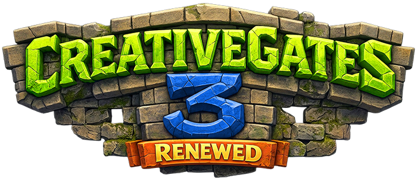
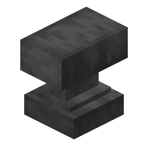

{ style="display: block; margin: 0px auto; max-height: 200px" }

# Player Guide

This guide covers creating and using CreativeGates as a player.

!!! info "Note"

    Items, required frame blocks, and which fills you can choose are configured by the server administrator. Contact your server administrator if something below does not match what you see in-game.

## How to Create a Portal

1. **Build a Frame**

    - Make a closed frame using solid blocks (rectangle or other enclosed shape).
    - The frame must contain the required blocks (default: **two emerald blocks**).
    - Frames can be **vertical** (wall) or **horizontal** (floor/ceiling), if the server allows horizontal gates.
    - Stand where you want the exit to be - your location when creating becomes this gate's exit.

2. **Activate the Portal**

    - A [{ .img-inline-text .img-before }Clock](https://minecraft.wiki/w/Clock) is the default creation tool.
    - Rename the clock with an [{ .img-inline-text .img-before }Anvil](https://minecraft.wiki/w/Anvil). That name becomes the **network name**.
    - Click the **inside** of the empty frame with the named clock.

3. **Choose a Fill (when offered)**

    - If you are allowed to pick fills and more than one is available, a fill picker opens.
    - Choose a look (nether portal, water, lava, particles, etc.) - only types the server allows appear.
    - For particle fills you may also set how dense the particles are.
    - If you cannot pick a fill, the server's default fill is used automatically.

4. **Link the Network**

    - Repeat at another location using a clock with the **same network name**.

5. **Travel**

    - Walk into the portal to teleport to another gate on that network.

## Gate Networks

Gates with the same network name are linked. Frame size, shape, and materials do not affect linking - only the network name must match. Spelling matters.

## Inspecting a Gate

[{ .img-inline-text .img-before }Blaze Powder](https://minecraft.wiki/w/Blaze_Powder) on a gate (or `/cg inspect` while looking at one) shows:

- Owner, network name, and how many gates are on that network
- Settings such as Secret, Entry/Exit Mode, Players/Mobs/Vehicles Usage settings

If a gate is **Secret** (restricted), only the creator (and staff with override) can read the full details.

You can also run:

```
/cg inspect
```

while looking at a gate. Use `/cg tool` if inspect/manage tools seem disabled for you.

## Managing a Gate

[{ .img-inline-text .img-before }Blaze Rod](https://minecraft.wiki/w/Blaze_Rod) on a gate you own (or `/cg manage`) opens the manage UI.

On modern Minecraft Servers this is a native dialog; older servers fall back to a clickable chat and chest menu system.

From manage you can toggle:

| Setting | Effect |
|---------|--------|
| **Secret** | Only the creator can read full inspect details (hides network info from others) |
| **Entry** | Whether this gate can be used as an entrance |
| **Exit** | Whether this gate can be used as an exit by other gates |
| **Players** | Whether players may travel through |
| **Mobs** | Whether living mobs may travel (leads, mounts, wandering mobs) |
| **Vehicles** | Whether boats, minecarts, and similar may travel |

If you have permission, manage also lets you change the **gate fill** after creation.

## Horizontal Gates

If enabled on the server, you can build floor or ceiling frames. Entering a horizontal gate may keep your momentum (falling/flying through), depending on server settings.

## Mobs and Vehicles

When allowed by the server and the gate settings:

- Mobs can wander through, follow on leads, or travel as living mounts
- Boats, minecarts, and other non-living vehicles can travel
- Both the **entry** and **destination** gate must allow that kind of traveler

## Tips

- Only matching network names link - check spelling on the creation item
- Breaking the frame deactivates the portal
- Use `/cg tool` to turn inspect/manage item tools on or off without dropping them
- If manage says only the creator can manage the gate, you do not own it (ask staff if needed)
