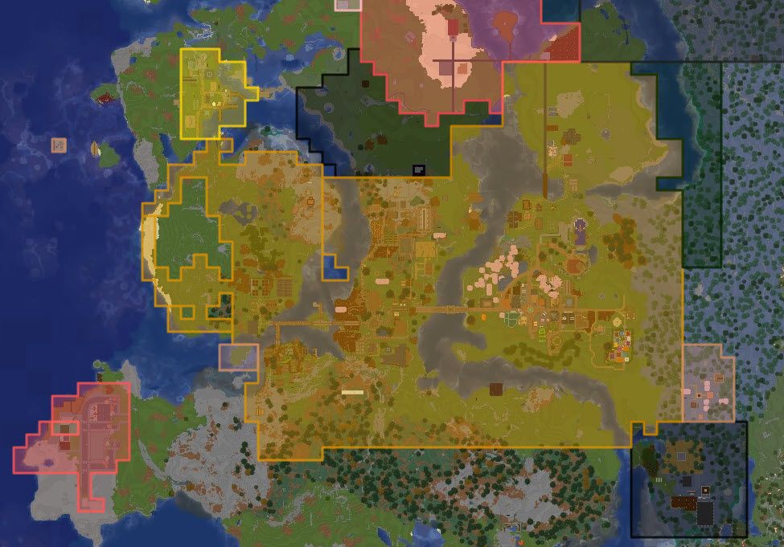

{ style="display: block; margin: 0px auto; max-height: 200px" }

# Dynmap Integration

Factions integrates with [Dynmap](https://www.spigotmc.org/resources/dynmap%C2%AE.274/) to automatically create visual representations of faction territories on the Dynmap web interface. It provides real-time territory visualization with customizable styling and detailed faction information popups.

{ style="display: block; margin: 10px auto; max-height: 300px;" }

!!! info "Note"

    For more information about Dynmap, visit their plugin listing page or [Wiki](https://github.com/webbukkit/dynmap/wiki).

!!! info "Shared configuration"

    Most map-related settings are **shared** across all map integrations (Dynmap, BlueMap, SquareMap, and Pl3xMap). Only `dynmapEnabled` and `dynmapLogTimeSpent` are specific to Dynmap. The shared settings use the `map*` prefix and are documented below; changing them affects all enabled map integrations.

## Features

### Territory Visualization
- **Area Markers**: Faction territories displayed as colored polygonal areas
- **Multi-World Support**: Territories shown across all worlds with faction claims
- **Connected Territory Detection**: Adjacent chunks automatically grouped into single polygons
- **Real-Time Updates**: Territory changes reflected on the map within 15 seconds
- **Asynchronous Processing**: Updates occur without impacting server performance

### Faction Information Popups
When clicking on faction territory, detailed information is displayed:

- Faction name and description
- Leader and member list
- Faction age and founded date
- Bank balance (if economy integration enabled)
- Faction flags in formatted tables
- Custom information via macros

### Visual Customization
- **Per-Faction Styling**: Different factions can have unique colors and styles
- **Special Faction Styling**: SafeZone and WarZone have distinct appearances
- **Line and Fill Properties**: Customizable border/fill colors, opacity, line weight
- **Layer Management**: Factions appear on dedicated map layer
- **Home Markers**: Faction homes displayed with custom icons

## Configuration

### Dynmap-Specific Settings

| Setting | Default | Description |
|---------|---------|-------------|
| `dynmapEnabled` | `true` | Enable/disable the Dynmap integration |
| `dynmapLogTimeSpent` | `false` | Log Dynmap update timing to console (debug) |

### Map Settings (Territory Layer)

These settings apply to Dynmap, BlueMap, and SquareMap. Only the territory (claims) layer is listed here; home and warps layers use the home/warps settings below.

| Setting | Default | Description |
|---------|---------|-------------|
| `mapLayerName` | `"Factions"` | Name of the territory (claims) layer in the map's layer menu |
| `mapLayerHiddenByDefault` | `false` | Whether the territory layer is hidden when first loading the map |
| `mapLayerPriority` | `2` | Territory layer ordering priority (lower numbers appear first) |
| `mapLayerMinimumZoom` | `0` | Minimum zoom level before territory layer becomes visible (0 = always visible) |
| `mapTerritoryMaxY` | `320` | Maximum Y level for territory extrusion; Dynmap is 2D and does not currently use this. |

### Map Settings (Home Warp Layer)

| Setting | Default | Description |
|---------|---------|-------------|
| `mapShowHomeWarp` | `false` | Enable/disable displaying Faction Homes on the map |
| `mapLayerNameHome` | `"Faction Homes"` | Name of the Faction Homes layer |
| `mapLayerHiddenByDefaultHome` | `true` | Whether the Faction Homes layer is hidden when first loading the map |
| `mapLayerPriorityHome` | `3` | Faction Homes layer ordering priority |
| `mapLayerMinimumZoomHome` | `0` | Minimum zoom level before Faction Homes layer becomes visible |
| `mapWarpHomeIcon` | `"redflag"` | Icon for Faction Homes. Dynmap: see `web/markers` folder for available icons |

### Map Settings (Other Warps Layer)

| Setting | Default | Description |
|---------|---------|-------------|
| `mapShowOtherWarps` | `false` | Enable/disable displaying Faction Warps (non-home) on the map |
| `mapLayerNameWarps` | `"Faction Warps"` | Name of the Faction Warps layer |
| `mapLayerHiddenByDefaultWarps` | `true` | Whether the Faction Warps layer is hidden when first loading the map |
| `mapLayerPriorityWarps` | `4` | Faction Warps layer ordering priority |
| `mapLayerMinimumZoomWarps` | `0` | Minimum zoom level before Faction Warps layer becomes visible |
| `mapWarpOtherIcon` | `"greenflag"` | Icon for Faction Warps. Dynmap: see `web/markers` folder for available icons |

### Faction Information Display

The faction popup description is customizable using the `mapDescriptionWindowFormat` setting. It is standard HTML that supports various macros (placeholders) that will be replaced with real information about the faction:

| Macro | Description |
|-------|-------------|
| `%name%` | Faction name |
| `%description%` | Faction description |
| `%players%` | List of faction members |
| `%players.count%` | Number of players in the faction |
| `%players.leader%` | Faction leader name |
| `%power%` | Current Faction power |
| `%maxpower%` | Max Faction power |
| `%claims%` | Number of claimed chunks |
| `%age%` | How long the faction has existed |
| `%money%` | Faction bank balance |
| `%flags.table1%` - `%flags.table10%` | Faction flags in 1-10 column tables |
| `%flags.map%` | All faction flags as a map (flag: value) |

**Dynamic Flag Macros:**

For each faction flag (like `monsters`, `pvp`, `explosions`, etc.), you can use:

- `%flagname.bool%` - The boolean value (true/false) of if it is enabled/disabled
- `%flagname.boolcolor%` - Boolean value with green/red color formatting
- `%flagname.color%` - Flag name with green/red color formatting

**Flag Table System:**

The `%flags.tableX%` macros automatically arrange all faction flags into columns separated with a pipe delimiter `|`. For example:

- `%flags.table1%` creates a single-column list
- `%flags.table3%` creates a 3-column list (default used in template)
- `%flags.table5%` creates a 5-column list for more compact display

The default configuration displays flags with color coding (it uses the `%flagname.boolcolor%` macro). The setting `mapUseDarkModeColors` toggles brighter green/red for dark map themes.

**Default Description Template:**

The description template uses HTML (setting `mapDescriptionWindowFormat`):

```html
<div class='infowindow'>
  <div>
    <div style='font-weight: bold; font-size: 150%;'>%name%</div>
  </div>
  <div style='margin-bottom:7px;padding-bottom: 7px;border-bottom: 1px solid gray;'>
    <div style='font-style: italic; font-size: 110%;'>%description%</div>
  </div>
  <div>
    <div><strong>Leader:</strong> %players.leader%</div>
    <div><strong>Members:</strong> %players%</div>
  </div>
  <div style='margin-bottom:7px;padding-bottom: 7px;border-bottom: 1px solid gray;'>
    <div><strong>Age:</strong> %age%</div>
    <div><strong>Bank:</strong> %money%</div>
  </div>
  <div>
    <div style='font-weight: bold;'>Flags:</div>
    <div>%flags.table3%</div>
  </div>
</div>
```

### Visibility Control

| Setting | Description |
|---------|-------------|
| `mapVisibleFactions` | Faction names/UUIDs to show (empty = show all). Use `world:<worldname>` to show all factions in a world |
| `mapHiddenFactions` | Faction names/UUIDs to hide. Use `world:<worldname>` to hide a world |
| `mapShowMoneyInDescription` | Enable the `%money%` macro (requires thread-safe economy) |
| `mapUseDarkModeColors` | Use brighter green/red in description for dark map themes |

**World-Specific Visibility:**

- Add `world:<worldname>` to show/hide all factions in a specific world
- Faction specification supports both names and UUIDs

```javascript
{
  "mapVisibleFactions": ["MyFaction", "world:survival"],
  "mapHiddenFactions": ["TempFaction", "world:creative"]
}
```

### Visual Styling

#### Default Style

By default, factions use either the Faction default colors or the map default colors. The primary color is used as the fill color, and the secondary color is used as the line color.

- **mapDefaultLineColor** / **mapDefaultFillColor**: Optional hex overrides (e.g. `"#00FF00"`). If null/empty, the `defaultFactionSecondaryColor` and `defaultFactionPrimaryColor` from the main Factions config will be used instead.
- **mapUseFactionColors**: When `true`, territory colors come from the faction's colors (set via `/f color`). When `false`, only the map defaults and per-faction overrides are used.

Global default line/fill opacity, line weight, and boost are defined in **mapDefaultStyle**. This object cannot be edited with `/f config`; edit `mstore/factions_mconf/instance.json` directly if you need to change default opacity or weight.

#### Per-Faction Overrides

The **mapFactionStyleOverrides** setting allows overriding style for specific factions. These overrides take precedence over faction colors and map defaults.

This setting cannot be configured with the `/f config` command - it must be edited manually in the `mstore/factions_mconf/instance.json` file.

!!! info "Note"
    Comments have been added in the example below to explain values; do not add comments in your actual JSON file or it may cause errors.

```javascript
{
  "mapFactionStyleOverrides": {
    "MyFactionName": { // The name of the faction - spelling must be exact
      "lineColor": "#0000FF", // The border color of faction territory
      "fillColor": "#0000FF", // The fill color of faction territory (inside the border)
      "lineOpacity": 1.0, // The opacity of the border
      "fillOpacity": 0.5, // The opacity of the fill (inside the border)
      "lineWeight": 3, // The thickness of the border line
      "boost": true // Whether to boost the faction layer to be on top of other layers
    }
  }
}
```

**Default Special Faction Styles:**

SafeZone and WarZone have built-in overrides (can be overridden again in `mapFactionStyleOverrides`):

```javascript
"SafeZone": {
  "lineColor": "#FFAA00",
  "fillColor": "#FFAA00",
  "boost": false
},
"WarZone": {
  "lineColor": "#FF0000",
  "fillColor": "#FF0000",
  "boost": false
}
```

## Advanced Configuration

### Custom Faction Description Template

Create rich HTML popups with custom styling using `mapDescriptionWindowFormat`. Example:

```html
<div class="faction-popup">
  <h2 style="color: #4CAF50;">%name%</h2>
  <p style="font-style: italic;">%description%</p>
  
  <div class="faction-info">
    <table>
      <tr><td><b>Leader:</b></td><td>%players.leader%</td></tr>
      <tr><td><b>Members:</b></td><td>%players.count%</td></tr>
      <tr><td><b>Power:</b></td><td>%power%/%maxpower%</td></tr>
      <tr><td><b>Claims:</b></td><td>%claims%</td></tr>
    </table>
  </div>
  
  <div class="faction-flags">
    <h4>Faction Settings:</h4>
    %flags.table2%
  </div>
  
  <div class="faction-economy" style="margin-top: 10px;">
    <b>Bank Balance:</b> %money%
  </div>
</div>
```

## Troubleshooting

### Common Issues

**Territories not showing:**

- Check `dynmapEnabled` is `true`
- Verify Dynmap is properly installed and running
- Check `mapVisibleFactions` and `mapHiddenFactions` settings
- Ensure factions have claimed territory

**Performance problems:**

- Enable `dynmapLogTimeSpent` to identify bottlenecks
- Limit visibility with `mapVisibleFactions` or `mapHiddenFactions`
- Check server console for error messages

**Money not displaying:**

- Ensure economy plugin is thread-safe
- Set `mapShowMoneyInDescription` to `true`
- Verify Vault integration is working and enabled
- Verify faction banks are enabled and permissions are correct

**Wrong colors/styles:**

- Verify faction colors (if `mapUseFactionColors` is true)
- Verify faction names in `mapFactionStyleOverrides` match exactly
- Check for typos in color codes (must be valid hex, e.g. `#RRGGBB`)

**Popups not showing information:**

- Check `mapDescriptionWindowFormat` template syntax
- Verify macros are spelled correctly
- Test with a simple template first
- Check browser console for JavaScript errors

### Debug Options

Monitor update performance by setting `dynmapLogTimeSpent` to `true` in the config.
