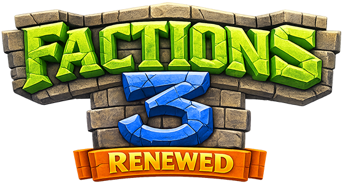

{ style="display: block; margin: 0px auto; max-height: 200px" }

# LWC Integration (Legacy)

Factions includes legacy support for LWC (Lightweight Chest Protection) to handle interactions between faction territory protection and individual chest protections. This integration ensures that LWC protections respect faction build permissions and vice versa.

!!! warning "Legacy Feature"
    The LWC integration is considered legacy functionality. Modern servers typically use other protection plugins or rely on Factions' built-in protection. This integration is maintained for compatibility with existing servers.

## Overview

The LWC integration addresses conflicts between:
- **Faction territory protection** - Prevents non-members from building
- **LWC chest protection** - Protects individual chests/containers
- **Permission inheritance** - Ensures consistent protection behavior

## Configuration

### Basic Settings

```javascript
{
  // Require faction build rights to create LWC protections?
  "lwcMustHaveBuildRightsToCreate": true,
  
  // Remove LWC protections if player loses build rights?
  "lwcRemoveIfNoBuildRights": false,
  
  // Remove alien LWC protections when territory changes hands?
  "lwcRemoveOnChange": {
    "BUY": false,     // When claiming from wilderness
    "SELL": false,    // When selling back to wilderness
    "CONQUER": false, // When claiming from another faction
    "PILLAGE": false  // When unclaiming from another faction
  }
}
```

### Recommended Settings

**Conservative approach (default):**
```javascript
{
  "lwcMustHaveBuildRightsToCreate": true,
  "lwcRemoveIfNoBuildRights": false,
  "lwcRemoveOnChange": {
    "BUY": false,
    "SELL": false, 
    "CONQUER": false,
    "PILLAGE": false
  }
}
```

**Aggressive cleanup:**
```javascript
{
  "lwcMustHaveBuildRightsToCreate": true,
  "lwcRemoveIfNoBuildRights": true,
  "lwcRemoveOnChange": {
    "BUY": false,
    "SELL": false,
    "CONQUER": true,  // Remove enemy protections when conquering
    "PILLAGE": true   // Remove protections when pillaging
  }
}
```

## How It Works

### Creation Control

When `lwcMustHaveBuildRightsToCreate` is enabled:

1. **Player tries to create LWC protection** (e.g., places sign on chest)
2. **Factions checks build permission** in current territory
3. **If no build rights:** Protection creation is blocked
4. **If has build rights:** Protection is created normally

**Example scenarios:**
```
✓ Faction member protects chest in own territory
✓ Ally protects chest in allied territory (if permissions allow)
✗ Enemy tries to protect chest in faction territory
✗ Neutral player tries to protect chest in claimed territory
```

### Cleanup on Permission Loss

When `lwcRemoveIfNoBuildRights` is enabled:

1. **Player tries to access LWC protection**
2. **Factions checks current build permission**
3. **If no build rights:** LWC protection is automatically removed
4. **Access is then handled by normal faction permissions**

**Common scenarios:**
- Player leaves faction → Their LWC protections in faction territory are removed
- Player gets demoted → Protections in restricted areas are removed
- Faction relationship changes → Allied protections may be removed

### Territory Change Cleanup

When `lwcRemoveOnChange` options are enabled:

**During territorial changes:**
1. **Territory ownership changes** (claim/unclaim/conquer)
2. **Factions scans for alien LWC protections**
3. **Removes protections** according to configuration
4. **Logs actions** for administrative review

**Change types:**
- **BUY**: Claiming wilderness → Remove any existing protections
- **SELL**: Unclaiming to wilderness → Remove faction protections
- **CONQUER**: Taking enemy territory → Remove enemy protections
- **PILLAGE**: Unclaiming enemy territory → Remove enemy protections

## Use Cases

### 1. Strict Territory Control

**Goal:** Ensure only faction members can protect items in territory

```javascript
{
  "lwcMustHaveBuildRightsToCreate": true,
  "lwcRemoveIfNoBuildRights": true,
  "lwcRemoveOnChange": {
    "CONQUER": true,
    "PILLAGE": true
  }
}
```

**Result:**
- Only faction members can create protections
- Protections removed when players lose access
- Enemy protections removed during conquest

### 2. Moderate Control

**Goal:** Prevent new unauthorized protections but preserve existing ones

```javascript
{
  "lwcMustHaveBuildRightsToCreate": true,
  "lwcRemoveIfNoBuildRights": false,
  "lwcRemoveOnChange": {
    "BUY": false,
    "SELL": false,
    "CONQUER": false,
    "PILLAGE": false
  }
}
```

**Result:**
- New protections require build rights
- Existing protections preserved for compatibility
- Manual cleanup required

### 3. Minimal Integration

**Goal:** Let LWC and Factions operate independently

```javascript
{
  "lwcMustHaveBuildRightsToCreate": false,
  "lwcRemoveIfNoBuildRights": false,
  "lwcRemoveOnChange": {
    "BUY": false,
    "SELL": false,
    "CONQUER": false,
    "PILLAGE": false
  }
}
```

**Result:**
- LWC operates normally
- Potential for conflicting protections
- Players may need to manage both systems

## Migration Strategies

### From LWC-Only Server

**Before enabling Factions LWC integration:**

1. **Audit existing LWC protections:**
```bash
/lwc admin view
/lwc admin find <player>
```

2. **Plan integration approach:**
   - Identify problematic protections
   - Decide on cleanup strategy
   - Communicate changes to players

3. **Gradual implementation:**
```javascript
{
  // Phase 1: Prevent new conflicts
  "lwcMustHaveBuildRightsToCreate": true,
  "lwcRemoveIfNoBuildRights": false,
  
  // Phase 2: After player adjustment period
  "lwcRemoveIfNoBuildRights": true
}
```

### To Alternative Protection Systems

**Migrating away from LWC:**

1. **Export protection data** if possible
2. **Disable LWC integration:**
```javascript
{
  "lwcMustHaveBuildRightsToCreate": false,
  "lwcRemoveIfNoBuildRights": false
}
```
3. **Remove LWC plugin**
4. **Implement alternative protection** (CoreProtect, etc.)

## Troubleshooting

### Common Issues

**Players can't protect chests:**
- Check `lwcMustHaveBuildRightsToCreate` setting
- Verify player has faction build permissions
- Test in unclaimed territory
- Check LWC permissions

**Protections disappearing:**
- Check `lwcRemoveIfNoBuildRights` setting
- Review recent faction permission changes
- Check `lwcRemoveOnChange` configuration
- Monitor console for removal messages

**Conflicting protections:**
- LWC and Factions may both protect same block
- Review integration settings
- Consider disabling problematic features
- Use `/f admin` to test behavior

**Performance issues:**
- Mass protection removal can cause lag
- Monitor during territory changes
- Consider disabling automatic removal
- Implement manual cleanup instead

### Debug Information

**Check LWC status:**
```bash
/lwc admin version
/lwc admin report
/lwc admin find <player>
```

**Test faction permissions:**
```bash
/f perm show build
/f admin on
/lwc create public  # Test with admin override
/f admin off
```

**Monitor integration:**
- Watch console during territory changes
- Test protection creation in different territories
- Verify behavior with different faction ranks

### Console Logging

Look for these messages in console:

```
[LWC] Protection created by Player123 at (x, y, z)
[Factions] LWC protection blocked - no build rights
[Factions] Removing LWC protection - player lost build rights
[LWC] Protection removed at (x, y, z) - owner: Player123
```

## Best Practices

### 1. Clear Policies

Document your LWC integration approach:
- When protections are allowed
- What happens during faction changes
- How to appeal protection removal
- Alternative protection methods

### 2. Gradual Implementation

- Start with restrictive settings for new protections
- Monitor impact on existing players
- Adjust cleanup settings based on server culture
- Provide transition period for major changes

### 3. Player Communication

- Announce integration changes clearly
- Provide examples of affected scenarios
- Offer assistance with protection migration
- Create help documentation

### 4. Regular Maintenance

- Periodically audit LWC protections
- Clean up orphaned protections
- Monitor performance impact
- Update documentation as needed

## Alternatives to LWC

### Modern Protection Solutions

**CoreProtect:**
- Block logging and rollback
- Better performance than LWC
- Integrates well with Factions

**GriefPrevention:**
- Land claiming system
- Can work alongside Factions
- Different protection model

**Residence:**
- Advanced region system
- Complex permission structures
- May conflict with Factions

**BlockLocker:**
- Modern chest protection
- Active development
- Better performance than LWC

### Factions-Only Approach

**Rely on faction permissions:**
- Use faction container permissions
- Implement rank-based access
- Create shared storage areas
- Educate players on faction protection

**Configuration example:**
```javascript
{
  "perm2default": {
    "container": [
      "LEADER", "OFFICER", "MEMBER"  // Only members can access containers
    ]
  }
}
```

## Migration Planning

### Assessment Questions

Before implementing LWC integration:

1. **Current setup:**
   - How many LWC protections exist?
   - Who owns them and where?
   - Are they in faction territory?

2. **Server goals:**
   - Should individual protection be allowed?
   - How strict should faction territory be?
   - What's the player expectation?

3. **Technical considerations:**
   - Server performance with many protections?
   - Staff time for manual cleanup?
   - Player support burden?

### Implementation Timeline

**Week 1-2: Planning**
- Audit current protections
- Test integration on staging server
- Develop migration strategy

**Week 3: Communication**
- Announce changes to players
- Provide documentation and examples
- Answer questions and concerns

**Week 4: Implementation**
- Enable basic integration
- Monitor for issues
- Provide player support

**Week 5+: Optimization**
- Adjust settings based on experience
- Clean up problematic protections
- Document lessons learned
