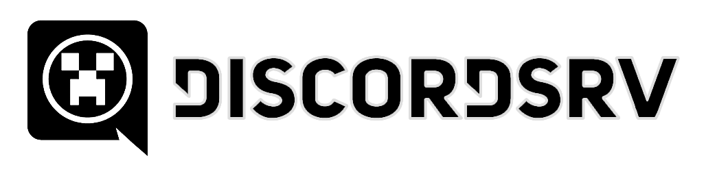

{ style="display: block; margin: 0px auto; max-height: 200px" }
{ style="display: block; margin: 10px auto; max-height: 115px;" }

# DiscordSRV Integration

FactionsChat integrates with [DiscordSRV](https://www.spigotmc.org/resources/discordsrv.18494/) so you can:

1. **Route Staff chat** from Minecraft to a **dedicated Discord text channel** (that staff can access), and  
2. **Relay messages from the staff Discord channel** back into Minecraft as **Staff chat** (broadcast to players with the staff permission).

Other chat modes (faction, ally, local, etc.) are **not** sent to Discord by default. Only **Global** (normal) chat follows DiscordSRV's usual game-chat rules, and **Staff** chat is redirected to your configured staff channel.

!!! info "Note"
    For DiscordSRV setup (bot token, `config.yml`, linked channels, roles), use their [documentation](https://docs.discordsrv.com/) and plugin page - not everything is configured inside FactionsChat.

## Installation

1. Install and configure **DiscordSRV** on your Minecraft server (bot, linked guild, base channels as you need).
2. Install **FactionsChat** (and its dependencies: MassiveCore, Factions).
3. In **FactionsChat** `config.yml`, set **`DiscordSRV.StaffChannel`** to your staff Discord channel's ID (see [Configuration](#configuration)).
4. **Restart** the server.

On startup, when DiscordSRV finishes connecting, FactionsChat registers that ID under DiscordSRV's internal **`staff`** channel key. You should see a console line similar to: `Registered channel ID ... for staff chat`.

## Configuration

### `DiscordSRV.StaffChannel` (FactionsChat)

In **`config.yml`**:

```yaml
DiscordSRV:
  StaffChannel: '000000000000000000'
```

Replace the placeholder with your Discord text channel ID:

1. In Discord, enable **Developer Mode** (User Settings → App Settings → Advanced).
2. **Right‑click** the staff text channel → **Copy ID**.
3. Paste the ID into **`StaffChannel`** (keep it quoted so YAML does not parse it as a number).

The default `000000000000000000` is invalid until you change it - staff relay will not work until a real channel ID is set.

### DiscordSRV side

You do **not** have to name the channel `staff` in Discord; FactionsChat only needs the **numeric ID**. DiscordSRV's own channel linking (e.g. `Channels` in DiscordSRV's `config.yml`) still applies to **normal** game chat. FactionsChat **adds** the `staff` mapping at runtime so DiscordSRV knows which channel ID corresponds to FactionsChat's **Staff** mode.

## How it works

### Minecraft → Discord

When a player sends chat that DiscordSRV would forward:

1. FactionsChat parses that and determines where it will go.
2. **Routing:**
   - **Global** chat - the message is sent to DiscordSRV's default handling (e.g. your linked "global" channel).
   - **Staff** chat - DiscordSRV is told to use the internal **`staff`** channel (your configured ID), so the line appears in your staff Discord channel.
   - **Any other channel/mode** (faction, ally, local, etc.) - the chat is not relayed to Discord.

### Discord → Minecraft

When someone posts in the **configured staff Discord channel**, FactionsChat detects the channel ID and relays that message only to the **Staff** channel.

## Troubleshooting

### Staff messages never appear in Discord or Minecraft

- Confirm **`DiscordSRV.StaffChannel`** is the correct numeric ID (not the default zeros).
- Confirm the player has the Staff Chat permission: **`factions.chat.staff`**.
- Check DiscordSRV is connected (no auth errors in console).
- Ensure you **restarted** your server after changing `StaffChannel` so DiscordSRV re-registers the mapping.
