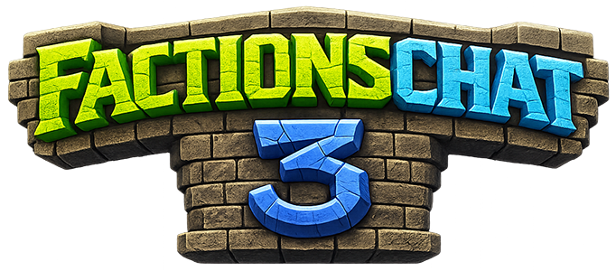

{ style="display: block; margin: 0px auto; max-height: 200px" }
{ style="display: block; margin: 10px auto; max-height: 115px;" }

# EssentialsX Integration

FactionsChat provides support for [EssentialsX](https://www.spigotmc.org/resources/essentialsx.9089/) SocialSpy, allowing you to spy on FactionsChat channels you are not part of while using SocialSpy.

!!! info "Note"

    For more information about EssentialsX, visit their plugin listing page or [Wiki](https://essentialsx.net/wiki/Home.html).

## Installation/Usage

1. Install EssentialsX on your server
2. Install FactionsChat3
3. Configure permissions as necessary for players to be able to use EssentialsX SocialSpy
4. Enable SocialSpy and you should now see chat in all channels (even for factions you are not part of)
