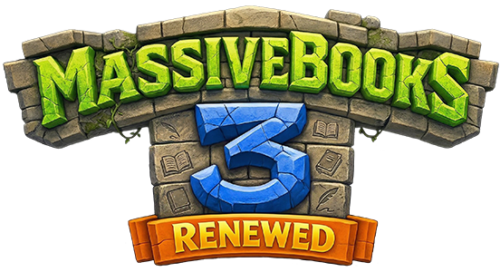

{ style="display: block; margin: 0px auto; max-height: 200px" }

# Economy Integration

MassiveBooks supports economy integration through [Vault](https://www.spigotmc.org/resources/vault.34315/) and any Vault-compatible economy plugin (e.g. EssentialsX, CMI, etc.). When economy is available (via MassiveCore’s money integration), you can charge players a **copy cost** when they use `/book copy`.

## Requirements

- **Vault** - Required for economy integration. MassiveBooks uses MassiveCore’s money API, which hooks into Vault.
- **Economy plugin** - Any Vault-compatible economy plugin that provides player balances and supports withdrawals.

## Features

### Copy Cost

- When a player runs `/book copy [times]`, they can be charged a **per-copy cost** in addition to the usual material cost (books, ink sacs, feathers).
- The amount charged is determined by the player’s **permissions**: the first matching permission in the `permToCopyCost` config defines the cost.
- In **creative mode**, the money cost (and material costs) are not applied.

### No Separate Economy Commands

MassiveBooks does not add its own economy commands.. Economy is used only for the copy cost. All money is taken from the **player’s balance** when they copy a book.

## Configuration

Copy cost is configured in the main config file: **`/mstore/massivebooks_mconf/instance.json`**, under **`permToCopyCost`**.

- **`permToCopyCost`** - A map from **permission node** to **cost (number)**. When a player copies a book, the plugin checks their permissions against this list (in order). The **first** permission they have determines the cost. The last entry is typically a fallback (e.g. `massivebooks.copycost.default`).

Example:

```javascript
"permToCopyCost": {
  "massivebooks.copycost.free": 0.0,
  "massivebooks.copycost.0": 0.0,
  "massivebooks.copycost.0.01": 0.01,
  "massivebooks.copycost.0.1": 0.1,
  "massivebooks.copycost.1": 1.0,
  "massivebooks.copycost.default": 0.0
}
```

- Grant **`massivebooks.copycost.free`** for no cost.
- Grant **`massivebooks.copycost.0.1`** for 0.10 per copy.
- Grant **`massivebooks.copycost.1`** for 1.00 per copy.
- Players with none of these get the **last** value (e.g. `massivebooks.copycost.default`). You can add as many permission/cost pairs as you need.

Cost is **per copy**: copying 3 times charges `3 × cost`.

## Permissions

The plugin creates dynamic permissions for each key in `permToCopyCost` (e.g. `massivebooks.copycost.free`, `massivebooks.copycost.1`). Grant the permission whose cost you want for a player or group. The **copy** action itself still requires **`massivebooks.copy`** (and **`massivebooks.copy.other`** or **`massivebooks.copy.copyrighted`** when copying another author’s or a copyrighted book).

## Troubleshooting

### Copy cost not being charged

- Ensure **Vault** is installed and an **economy plugin** is installed and linked to Vault. MassiveCore must be able to use the economy (check your server or MassiveCore docs).
- Ensure **`permToCopyCost`** in the config has at least one entry and that players have one of those permissions (or the fallback at the end applies).
- Confirm the cost for that permission is greater than 0 if you expect a charge.
- Creative mode players are not charged.

### Players charged when they shouldn’t be

- Grant **`massivebooks.copycost.free`** (or another 0.0 cost permission) and ensure it appears **before** higher-cost entries in the permission check order. The first matching permission in the config order is used.
- Or set the default (last) entry to `0.0` and avoid granting any of the higher-cost permissions.

### "Failed to remove money" or similar

- The player may have insufficient balance at the moment the copy is executed (e.g. balance changed between the check and the withdrawal). Ensure the economy plugin is stable and that balances are correct.
- Check the server console for Vault or economy plugin errors.

### Testing

- Use an economy plugin’s command to give a player money (e.g. `/pay` or `/money give`).
- Grant a permission that has a non-zero cost (e.g. `massivebooks.copycost.0.1`).
- Run `/book copy 1` with a written book in hand and confirm the balance decreases and the copy succeeds.
