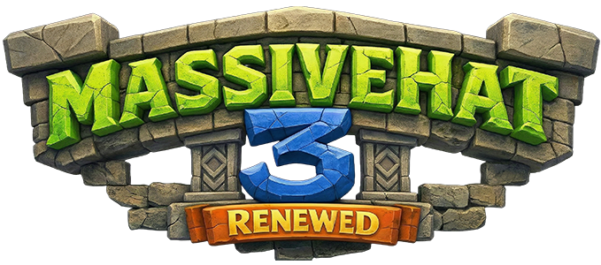

{ style="display: block; margin: 0px auto; max-height: 200px" }

# Player Guide

This guide explains how to use MassiveHat as a player.

!!! info "Note"
    Command names (e.g. `/hat`, `/mhat`, `/blockhat`) and which blocks or items you can wear are set by your server. If something doesn’t work or is different from this guide, ask your server administrator.

## Introduction

MassiveHat lets you wear the block (or allowed item) you’re holding on your head as a hat. You use it like a helmet: hold the block, run the command, and the block is placed on your head.

## Commands

- **`/hat`**, **`/mhat`**, **`/blockhat`**, **`/massivehat use`** (or similar)  
  Wears the block or item in your hand as a hat. Exact aliases depend on server config (e.g. `aliasesMhat` and `aliasesMassiveHat`).

If your server has the base command (e.g. `/massivehat`), you may also have:

- **`/massivehat`** (or configured alias) - Base command; shows help or subcommands.
- **`/massivehat use`** (or **wear** / **apply**) - Same as the shortcut: wear the item in hand as a hat.

You are told in-game that you can also equip your hat like a regular helmet (put the block in the helmet slot) if the server allows it.

## How to Wear a Hat

1. **Hold** the block or item you want as a hat in your main hand.
2. **Run** the hat command (e.g. `/hat` or `/mhat`).
3. The block is now on your head.

Only blocks (and any items your server allows, such as banners) that the server has configured as hats can be used. If the command doesn’t work, the block or item may be disabled - check with staff.

## Tips

- If you have permission, you can use the same command to swap hats: hold a different block and run the command again.
- Some servers restrict which blocks can be used as hats to avoid lag or abuse; if a block doesn’t work, it may be disabled in the config.
